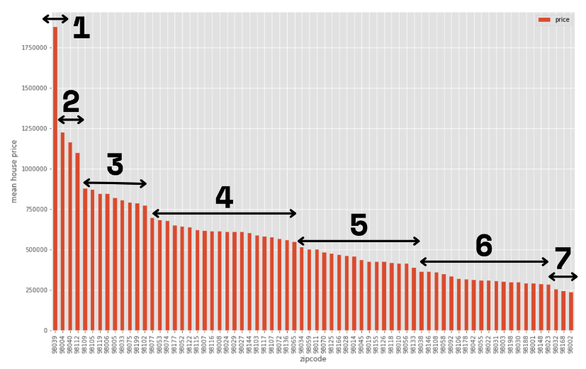

# King-County-Homes-Project

**Author:** Lili Beit
***

## Overview
A large real estate firm in the Seattle area is seeking to maximize prices for home sellers. My task is to use data from previous home sales to predict future prices.  The firm aims to cast a wide net and attract clients at all price points from throughout the county.

## Business Problem
The real estate firm operates throughout King County, which includes the metropolis of Seattle, as well as suburban and rural areas.  Home prices vary greatly between these diverse landscapes, as well as between neighborhoods in Seattle.  The firm needs to accurately price a home based on data such as its size, location, and number of bedrooms, in order to get the best sale price for its clients.  It needs a model that can generate a good estimate of value for homes in every part of the county.

## Data Understanding
To build a model to predict prices, I used data from the King County House Sales dataset, which can be found here:

(https://www.kaggle.com/harlfoxem/housesalesprediction)

This dataset contains information on over 21,000 houses sold in King County between May, 2014 and May, 2015. Although the median sale price is $450,000, the dataset also includes multi-million dollar homes. At the top of the market are about 1,000 properties which sold between $1.2 million and $7.7 million, so the price data are right-skewed with a few very high outliers.

In addition to sale price, the dataset includes details about the homes, including square footage, lot square footage, number of bedrooms, zip code, and the dates when the houses were built, renovated, and sold. Although the data seem mostly accurate, some values are missing, and many columns have outliers.

## Analysis

Nearly all features of the original data were valuable in creating a precise model that could estimate home prices throughout the county.  Elements that are highly correlated with price include the square footage of the home, and the average square footage of its 15 closet neighbors, as shown in the graphs below.

The prediction model's accuracy vastly improved after zip code classifications were introduced.  The graph below shows the zip codes ordered by average home price, and divided into seven categories which were used to train the model.

## Conclusions

### Recommendations

To accurately price homes in King County, the real estate firm should use a model that segments zip codes into price-based categories. This model combines data about house features that are highly correlated with price, such as square footage, with knowledge of the mean house price of each zip code, to produce predictions that explain 83% of the variance from the mean price. This model is a significant improvement over a baseline regression model, which only explains 63% of the variance. In addition, while the baseline regression model's predictions were an average of $136K off from the actual prices of the test data, this model's Mean Absolute Error was only $87K for the test data.

Square footage and grade have the strongest positive correlation with price, but the model vastly improved after zip code classifications were included. Unsurprisingly, location seems extremely important to home buyers in the Seattle area, which is a diverse landscape that includes, urban, suburban, and rural neighborhoods.

### Further Investigation

Much work remains to investigate potential improvements to this model. In particular, including interactions among variables may increase the model's accuracy. Since square footage and zip code are such powerful predictors of price, perhaps an interaction between these variables would enhance the model. Also, since zip code classification was so effective in improving the model, perhaps including a few more zip classes would help by segmenting the market even further.

In addition, the month when the house was sold may affect price, and was not tested in these models. Also not tested was a feature that would indicate whether the house was recently renovated, for example in the past 20 years. It may also help to programmatically iterate through the variables to select the best features for inclusion in the model.

Finally, a handful of properties (less than half of one per cent) must be excluded from this model. Creating models that can generate predictions for these homes as well would benefit the real estate firm.